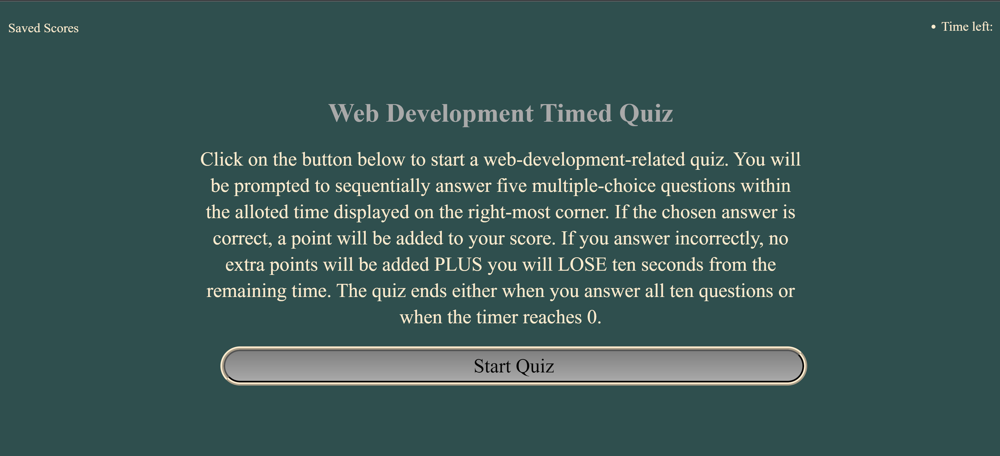
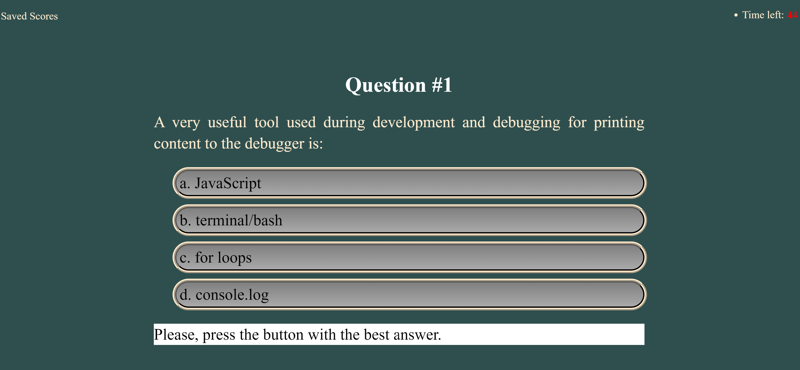
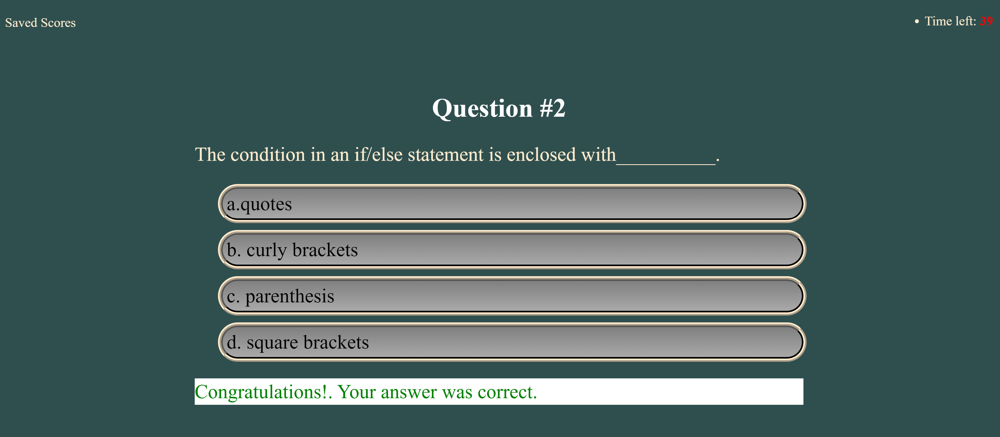
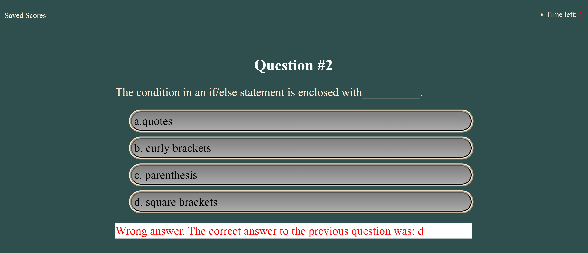
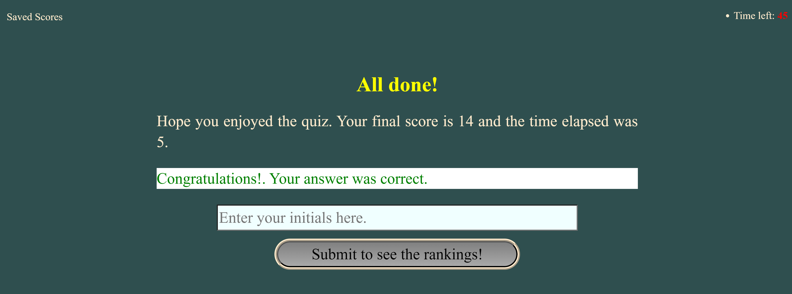
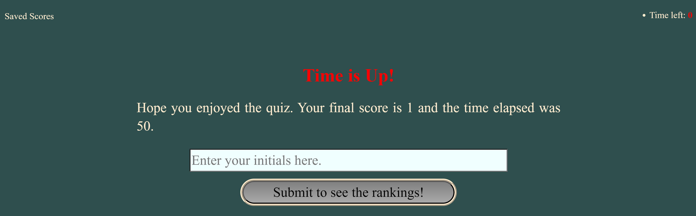
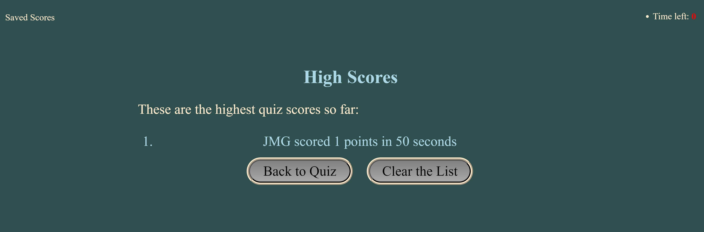

# Web Development Timed Quiz

With the purpose of providing prospective web developers the opportunity to review their knowledge of the fundamentals, we decided to create a timed quiz app containing questions relating
to the basic syntax and methods of the languages we have been learning in Bootcamo and the tools we have been employing. In addition, the creation of such an application from scratch allowed
the author much needed practice in implementing user story requirements by employing notions like DOM traversal, the dynamic generation of content, event listeners, time intervals and basic
client-side storage. The application was designed to be responsive enough so that it can be used without issues in screens of various sizes.

## Usage

The application is currently deployed in GitHub pages at the following URL: https://jguemarez.github.io/WebDevQuiz/.

When the page loads, the user will be greeted with the following screen message:

Pressing the "Start Quiz" button will lead the user to the first question and some instructions on the bottom of the page:

Note the timer on the upper right corner. It starts at 50, denoting the 50 seconds initially allotted to complete the quiz.

Depending on whether the answer selected by pressing the button corresponding to "a","b","c", or "d" is wrong, the user will be greeted by one of the following messages and automatically passed to the next question:

Message displayed when the answer is correct. In this case the countdown from 50 to 0 decrements by 1 each second.

Message displayed when the answer is wrong. In this case, 10 seconds are substracted from the remaining time and no points awarded.

If the user answers all the questions before time runs up, then the counter will be stopped, and the user will be shown the final score. Also an input field will require the user to enter his/her initials in order to save the achieved score and the time it took (minus 10 * (number of wrong answers)) to answer it.

If, on the other hand, the user runs out of time, then the following screen will appear, showing the final score and prompting to enter initials:

Either way, once the initials are entered, the user will be shown a list of the highest scores up to that point. Underneath it, there will be two buttons. The one on the right will reset the quiz if clicked, while the second one will delete items from the list.

## Authorship

This Web App is of the authorship of Jonathan Maldonado Guemarez. The public repo can be found at :
https://github.com/jguemarez/WebDevQuiz

The Normalize.css (used to do a CSS reset) was downloaded from: https://necolas.github.io/normalize.css/

The .gitignore file was taken from the BootCamp repo located at: https://git.bootcampcontent.com/

## Support

You can reach me concerning any doubts at: cantor.dedekind112358@gmail.com.

## Contributing

Any constructive criticism is welcome. Please open an issue to review before enacting any change to the code.

## License

This open-source project is licensed under the 
[MIT](https://choosealicense.com/licenses/mit/) license. Please click the link for more information.